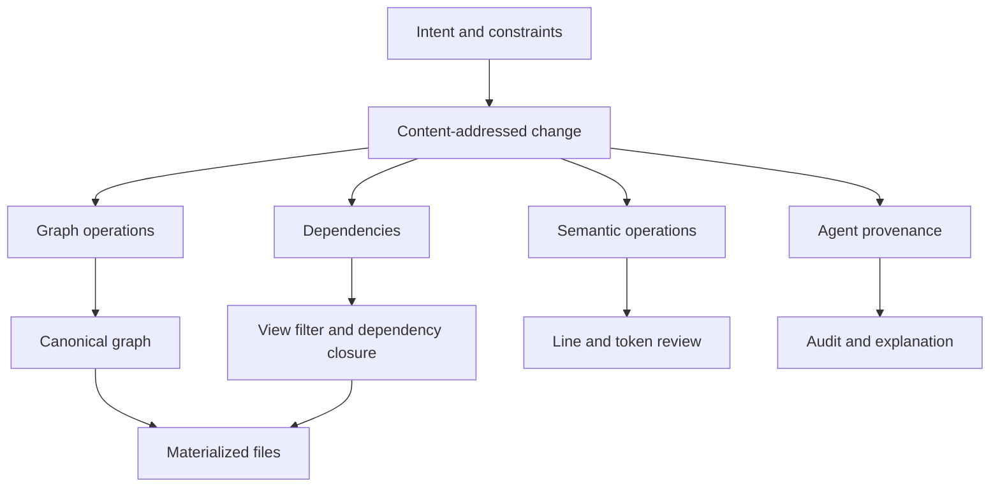

# Why Changes Compose: The Atomic Data Model

Atomic represents a repository as content-addressed changes over a graph, with a semantic layer for files, lines, and tokens. Independent changes can compose because each operation carries explicit graph context and dependencies; incompatible edits remain visible as conflicts instead of being silently discarded.

## What “changes compose” means

Composition means incorporating several recorded changes into one visible repository state.

For independent, dependency-complete changes:

```text
materialize(A + B) = materialize(B + A)
```

This does **not** mean every edit is conflict-free or that view history order is irrelevant. It means Atomic can combine independent graph operations without replaying one textual diff onto the output of another.

## The data model in one diagram



The graph and semantic layers describe the same work for different purposes.

| Layer | Stores | Used for |
|---|---|---|
| **Graph storage** | Immutable content ranges and directed edges | Persistence, ordering, merge context, materialization |
| **Semantic overlay** | File, line, and token identities and operations | Human-readable diff, token review, blame, conflict classification |

## Graph storage: vertices and edges

A graph vertex identifies an immutable byte range from a recorded change. Edges describe ordering and structural relationships between vertices.

```text
vertex A ──before──▶ vertex B ──before──▶ vertex C
```

An insertion records its context in the graph rather than only a line number in a temporary file snapshot. A deletion records graph state that marks content as deleted while preserving enough context for other changes to be interpreted.

This matters because line numbers drift. Graph positions and dependencies identify *which recorded content* an operation relates to.

## Semantic overlay: trunks, branches, and leaves

Raw byte ranges are efficient storage, but reviewers think in files, lines, and tokens. Atomic therefore maintains a required semantic overlay:

| Semantic object | Represents |
|---|---|
| **Trunk** | A file with stable identity |
| **Branch** | A line in that file |
| **Leaf** | A token or meaningful segment within a line |

The semantic layer enables a token-level diff such as “the operator changed from `>` to `>=`” instead of only reporting that an entire line changed.

```bash
atomic diff --word-diff
```

The graph remains the persistence and merge layer; the semantic model makes its operations reviewable by humans.

## A small Lego analogy

Think of graph context as connection points on bricks:

- A brick is recorded with the pieces it connects between.
- Two bricks attached at independent connection points can be added in either order.
- Two different bricks claiming one incompatible connection point require a decision.

The analogy stops there. Atomic vertices are byte ranges, edges encode relationships, and the semantic layer—not the graph vertex itself—represents lines and tokens.

## Changes and dependencies

An Atomic change is a content-addressed artifact. It contains the operations and metadata needed to identify what was recorded, plus references to changes it depends on.

```text
change C depends on change B
change B depends on change A

insert C ⇒ include A, then B, then C in the dependency closure
```

When a change is inserted into another view, Atomic computes the missing transitive dependencies. The source view is not modified, and the graph operations do not need to be copied because they already live in the canonical graph.

```bash
atomic insert change <HASH> --to <TARGET_VIEW>
```

The same serialized change keeps its identity across views and repositories. Two separately recorded edits that look alike can still have different identities when their graph context or hashed metadata differs.

## Views are filters, not copies of the graph

All recorded graph edges live in one canonical graph. A view selects which changes are visible through its own change set, its parent chain, and dependency closure.

```text
main
└── dev
    ├── feature-auth
    └── feature-payments
```

`feature-auth` sees changes from `main`, `dev`, and itself. It does not duplicate those ancestors' graph data.

Promoting a feature is therefore a metadata operation over change references:

```bash
atomic insert preview feature-auth --to dev
atomic insert view feature-auth --to dev
```

Switching views still materializes the selected state into the checkout's working directory. A view is not a separate filesystem.

## When changes compose cleanly

| Situation | Expected result |
|---|---|
| Different files | Clean composition |
| Different regions of one file | Clean composition |
| Different tokens on one line | Often a clean token-level composition |
| The same recorded change arrives by two paths | Included once by identity |
| Rename in one view, content edit in another | File identity allows the edit to follow the rename |

These results depend on valid graph context and the required dependency closure.

## When Atomic records a conflict

Atomic does not claim that incompatible intent can be merged automatically.

| Situation | Result |
|---|---|
| Different content at the same structural position | Order/content conflict |
| Different replacements for the same token | Conflict |
| Two files created at the same path | Name conflict |
| Incompatible binary edits | Whole-file conflict |

A genuine conflict is materialized with markers and reported consistently:

```bash
atomic status --short
atomic conflicts --short
```

The user edits the file to the intended result and records the resolution. See [Merging & Conflicts](/concepts/merging-and-conflicts) for conflict formats, guarantees, and current limitations.

## Why the model matters for AI agents

AI coding agents create many small operations, often across parallel tasks. Atomic connects each recorded change to additional structured evidence:

- the intent and acceptance criteria that defined the task;
- observed exploration, edit, and verification events;
- model and session attribution;
- line and token-level semantic operations;
- dependencies and the exact view state reviewed before promotion.

This lets a reviewer inspect the file and graph summary, inline AI metadata, Change Ledger, and related graph evidence:

```bash
atomic change <HASH>
atomic provenance trace <HASH>
atomic vault query neighbors change:<HASH> --depth 2
```

The provenance trace is an audit trail of observed activity and inferred causal links. It is not a model's private chain-of-thought.

## Key definitions

- **Change**: a content-addressed set of graph and semantic operations with metadata and dependencies.
- **Canonical graph**: the repository-wide store containing graph operations from all views.
- **View**: a named change-set filter over that graph.
- **Dependency closure**: every transitive prerequisite required by a selected change.
- **Materialization**: rendering one view's visible graph state into files.
- **Semantic operation**: a file-, line-, or token-level interpretation used for review.
- **Conflict**: an explicit record that two operations cannot be combined without a decision.

## Next steps

- [Graph Model & AI Attribution](/concepts/graph-model-explained)
- [Dual-Layer Diff & Semantic Merge](/concepts/dual-layer-diff)
- [Change Identity](/concepts/change-identity)
- [Merging & Conflicts](/concepts/merging-and-conflicts)
- [How to Run Multiple AI Coding Agents Without Merge Conflicts](/guides/multiple-ai-agents-without-merge-conflicts)
