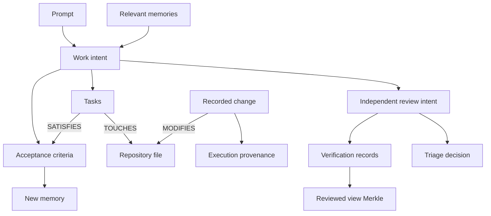
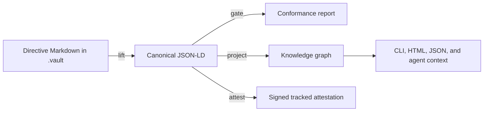
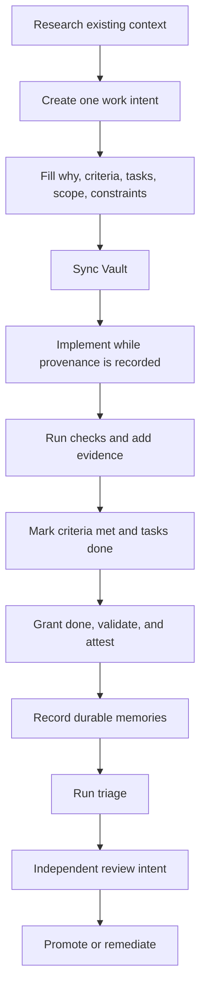

# Atomic Vault

Atomic Vault is the repository-native system for recording **why work exists**, **what must be true before it is done**, **what the project learned**, and **who independently reviewed the resulting change**.

It is not just a folder of Markdown notes. Vault entries are authored in readable Markdown, lifted into typed canonical JSON-LD, checked by a closed-world gate, signed with Atomic identities, projected into the knowledge graph, and recorded with the code they explain.



The result is a chain you can traverse in either direction:

```text
prompt → intent → criterion → task → file ← change → review → promotion
                         └──────────────→ memory → future intent
```

## What Vault is for

Vault gives different project facts different durable types:

| Vault object | Purpose |
|---|---|
| **Goal** | A focused work session that can group one or more intents. |
| **Intent** | A unit of work: why it matters, the acceptance bar, tasks, scope, and constraints. |
| **Acceptance criterion** | A checkable outcome that defines what `done` means. |
| **Task** | An ordered work item that satisfies criteria and names the files it expects to touch. |
| **Memory** | Durable knowledge learned from work: a decision, lesson, constraint, preference, or context. |
| **Attestation** | A signed canonical snapshot proving which identity asserted an intent or memory and whether it has changed. |
| **Review intent** | An independent, signed judgment about whether another intent's changes genuinely satisfy their criteria. |
| **Triage report** | A reproducible projection of candidate changes, intent coverage, evidence, provenance, and promotion findings. |

The Vault complements the change graph rather than replacing it. Source changes still live in Atomic's content-addressed graph. Vault gives those changes typed reasons, proof obligations, durable learning, and review authority.

## The three layers

Atomic keeps authoring, canonical data, and presentation separate:



### 1. Authoring surface

People and agents edit directive-based Markdown under `.vault/`:

```text
.vault/
├── intents/<uid>/intent.md
├── memory/<uid>.md
├── attestations/<intent-or-memory>/attested.md
└── goals/...
```

The prose remains readable, but directive names and attributes carry the typed structure.

### 2. Canonical form

Atomic lifts the Markdown into canonical JSON-LD. Stable `@id` values identify intents, criteria, tasks, memories, and references. The canonical form is what Atomic hashes, signs, validates, and projects into the knowledge graph.

### 3. Read-time projections

`atomic intent show`, `atomic memory show`, graph queries, triage JSON, and the triage HTML report are projections of canonical facts. A projection can be regenerated; the signed facts and content-addressed changes are the durable record.

## Initialize and synchronize the Vault

`atomic init` initializes Vault for new repositories. To add Vault to an existing Atomic repository, run:

```bash
atomic vault init
```

Vault commands operate on the repository's indexed Vault state. The `.vault/` tree is the editable, materialized authoring surface.

The synchronization direction is explicit:

```text
.vault Markdown -- atomic vault sync --> repository Vault state
repository Vault state -- atomic vault materialize --> .vault Markdown
```

After editing anything under `.vault/`, synchronize before running commands that read the stored canonical entry:

```bash
atomic vault sync
```

To restore materialized files from the stored Vault state:

```bash
atomic vault materialize

# Or materialize one Vault path
atomic vault materialize --path intents/<uid>/intent.md
```

:::warning Sync before validation or attestation
`atomic intent show`, `validate`, `attest`, and the corresponding memory commands read the repository's Vault state. If you edit `.vault/` and skip `atomic vault sync`, they can see the previous version rather than your current file.
:::

## Intent identity: four forms you will see

An intent has several identifiers for different interfaces:

| Form | Example | Used for |
|---|---|---|
| Human key | `TRAI::lee::4` | CLI lookup and human conversation. |
| UID | `01KZE9KMFE9TGASXJRJTYYJ6X8` | Stable entry identity and directory name. |
| Canonical RDF identity | `urn:atomic:intent:01KZE9KMFE9TGASXJRJTYYJ6X8` | Typed references such as `reviews`, `remediates`, and `derivedFrom`. |
| Knowledge-graph node ID | `intent:01KZE9KMFE9TGASXJRJTYYJ6X8` | `atomic vault query neighbors` and graph traversal. |

Use the form expected by the interface. In particular, use a **canonical intent URN** when creating a review:

```bash
atomic intent new "Review route-derived clues" \
  --review urn:atomic:intent:01KZE9KMFE9TGASXJRJTYYJ6X8
```

A bare UID is not the same graph identity as `urn:atomic:intent:<UID>`.

## The end-to-end Vault workflow

A complete unit of work follows this lifecycle:



### 1. Research before authoring

Check for existing work and retrieve relevant project knowledge before creating a duplicate intent:

```bash
atomic intent list
atomic vault context "token rotation"
atomic vault context --files src/auth/login.rs
```

You can seed context retrieval from an existing intent:

```bash
atomic vault context --intent AUTH::alice::12
```

`atomic vault context` ranks relevant memories and returns a bounded, prompt-ready block. Use `--json` for tools or `--candidates-only` to inspect ranking without loading memory bodies.

### 2. Create one intent for the unit of work

```bash
atomic intent new "Reject expired refresh tokens" --kind bug
```

Kinds come from a closed vocabulary:

| Kind | Use for |
|---|---|
| `feature` | New product or platform capability. |
| `bug` | A correction to behavior that should already work. |
| `chore` | Maintenance without a product behavior change. |
| `review` | Independent judgment of another intent. |
| `remediation` | Follow-up work that corrects already-promoted behavior. |

The command prints a human key, UID, and path under `.vault/intents/`.

### 3. Define the problem and acceptance bar

Replace every scaffold stub before coding:

```text
:::why
Expired refresh tokens currently reach the session-creation path, allowing a
credential beyond its declared lifetime to create a new session.
:::

:::acceptance-criterion{#<UID>-ac-1 status=unmet requiredKinds=unit,integration}
An expired refresh token is rejected before session creation, while a valid
refresh token still creates a session.
:::

:::task{#<UID>-1 status=open criteria=<UID>-ac-1}
Reject expired tokens in the refresh-token validation path and cover both the
expired and valid cases.
::file-ref{path=src/auth/refresh.rs}
::file-ref{path=tests/refresh_tokens.rs}
:::

:::scope-in
Refresh-token lifetime validation and its tests.
:::

:::scope-out
Access-token validation, token storage, and user-session expiration policy.
:::

:::constraint
Preserve the existing error type returned for invalid refresh credentials.
:::
```

The directives become graph nodes and edges:

```text
intent ──HAS_ACCEPTANCE_CRITERION──→ criterion
intent ──HAS_TASK──────────────────→ task
task   ──SATISFIES─────────────────→ criterion
task   ──TOUCHES───────────────────→ file:src/auth/refresh.rs
intent ──HAS_SCOPE_IN / OUT────────→ scope items
intent ──HAS_CONSTRAINT────────────→ constraint
```

The `::file-ref` path must be the exact repository-relative path. Triage joins a task's `TOUCHES` edge with a change's `MODIFIES` edge through that shared file node.

### 4. Synchronize and start work

```bash
atomic vault sync
atomic intent update <INTENT> --status in_progress
atomic vault sync
```

Intent statuses are closed values: `backlog`, `todo`, `in_progress`, `done`, and `icebox`.

When an Atomic agent integration is active, the session view and turn recording are automatic. The prompt becomes a goal in the provenance graph; reads, edits, commands, checks, decisions, and the final patch proposal become typed activity nodes. Do not manually record over an integration-managed turn.

### 5. Verify each criterion

A criterion may declare the checks required before `status=met`:

```text
requiredKinds=unit,integration
```

Allowed verification kinds are:

- `unit`
- `integration`
- `e2e`
- `runtime`
- `manual`

After running a check, add a verification record to the matching criterion:

```text
::verification{kind=unit outcome=pass scope=ac
  observation="cargo test refresh_token_rejects_expired passed"}
```

Verification outcomes are closed to `pass` or `fail`. Scope is either `ac` for one acceptance criterion or `view` for a whole-view baseline.

For review evidence, also pin the observation to the exact view state:

```text
::verification{kind=e2e outcome=pass scope=ac
  observedAtMerkle=<TRIAGE_VIEW_MERKLE>
  observation="The expired-token request returned 401 and created no session"}
```

The gate does not decide whether prose is persuasive. It checks the structural claim: when a criterion requires `unit` and `integration`, the latest record of each required kind must pass before a stored `met` status conforms.

### 6. Complete, validate, and attest

After the implementation and checks hold:

1. Change task statuses from `open` to `done`.
2. Change satisfied criteria from `unmet` to `met`.
3. Add verifier, evidence, or the required verification records.
4. Synchronize.
5. Request `done`, validate, and attest.

```bash
atomic vault sync
atomic intent update <INTENT> --status done
atomic vault sync
atomic intent validate <INTENT>
atomic intent attest <INTENT>
atomic intent verify <INTENT>
```

Before attestation, `validate` can report the fillable `attributedTo` and `proof` violations. `atomic intent attest` refuses every non-fillable violation, fills authorship from the signing identity, signs the canonical node, re-runs the gate, self-verifies the proof, and writes a tracked attestation entry.

After attestation:

```bash
atomic intent list
```

A completed intent should show `done`, a fresh attestation, and a valid signature for the resolving identity.

## The SHACL-style conformance gate

Atomic currently implements the documented SHACL-style, closed-world shape semantics directly in Rust. A general Turtle-backed SHACL evaluator is a later implementation milestone; the gate behavior is already enforced by the CLI.

The gate checks structure and referential integrity, not whether the prose is wise:

| Shape | Enforces |
|---|---|
| Intent | Known status and kind, a non-empty `why`, author DID and proof, and scope-out when scope-in is declared. |
| Review | A `kind=review` intent must declare at least one `reviews` edge; non-review intents cannot carry one. |
| Acceptance criterion | Known status; a met criterion must have evidence or all required verification kinds passing. |
| Task | Known task status and every `SATISFIES` target must be a criterion declared by the same intent. |
| Memory | Known memory kind and status, non-empty text, author DID, and proof. |

A malformed graph receives a `ValidationReport` with the focus node, shape, property path, and message. The gate never silently fixes a load-bearing fact.

:::note Presence is enforced; content is judged in review
The gate can require a reason, evidence record, or review edge. It does not claim the reason is good or that an observation proves the criterion. That content judgment belongs to the independent reviewer.
:::

## Attestations and freshness

An attestation contains canonical JSON-LD with:

- The node's stable `@id` and `@type`.
- `attributedTo`, a `did:atomic:` identity.
- A BLAKE3 `contentHash`.
- An `eddsa-jcs-2022` Data Integrity proof.
- The verification method used to check the Ed25519 signature.

```bash
atomic intent attest <INTENT> --identity alice-work
atomic intent verify <INTENT> --identity alice-work
```

Attestation is additive: the authored intent remains its own entry, while the signed canonical node is stored as a tracked attestation entry and recorded with normal repository changes.

If the source intent changes after signing, the attestation becomes **stale**:

```text
the attestation for <INTENT> is stale
(the intent changed since it was signed)
```

A stale signature is not approval of the current bytes. Re-grant the completed state when needed, then attest the current intent again.

## Memories: durable knowledge from completed work

Intents describe a unit of work. Memories preserve what should influence future work after that intent is finished.

Memory kinds are closed and intentionally specific:

| Kind | Record |
|---|---|
| `decision` | A chosen approach, its outcome, and why it was selected. |
| `lesson` | A corrective insight learned from failure or surprise. |
| `constraint` | A rule or limitation future work must respect. |
| `preference` | A durable tooling, style, or workflow preference. |
| `context` | Background that remains useful but is not one of the above. |

Create one memory per durable insight and link it to the most specific source:

```bash
atomic memory new --kind lesson \
  --text "Refresh expiry must be checked before session allocation; checking later leaves an orphaned session on rejection" \
  --derived-from urn:atomic:ac:<UID>-ac-1,urn:atomic:task:<UID>-1
```

Then gate, sign, and verify it:

```bash
atomic memory validate <MEMORY_ID>
atomic memory attest <MEMORY_ID>
atomic memory verify <MEMORY_ID>
```

`derivedFrom` becomes a `prov:wasDerivedFrom` edge. Prefer the narrowest source available:

| Source | Canonical form |
|---|---|
| Acceptance criterion | `urn:atomic:ac:<UID>-ac-N` |
| Task | `urn:atomic:task:<UID>-N` |
| Todo | `urn:atomic:todo:<id>` |
| Intent fallback | `urn:atomic:intent:<UID>` |

The next unit of work can retrieve those memories directly:

```bash
atomic vault context --intent <NEW_INTENT>
atomic vault context --files src/auth/refresh.rs
```

This creates the knowledge flywheel:

```text
memory → informs intent → motivates change → produces provenance
   ↑                                             │
   └──────────── review and learning ────────────┘
```

## Query the Vault graph

Vault entries are projected alongside code entities, files, changes, views, and sessions. Query the graph instead of reconstructing relationships from filenames:

```bash
# Discover an intent's exact graph node ID
atomic vault query search "expired refresh token"

# Traverse intent → criteria/tasks → files
atomic vault query neighbors intent:<UID> --depth 2

# See tasks and changes joined at one file node
atomic vault query neighbors file:src/auth/refresh.rs --depth 1

# Find memories and changes related to a concept
atomic vault query search "refresh expiry"
```

The critical code-to-intent join is:

```text
task ──TOUCHES──→ file:src/auth/refresh.rs ←──MODIFIES── change
```

This is how triage determines that a candidate change is covered by an intent. No issue number in a message is required.

See [Querying the Knowledge Graph](./querying-the-graph.md) for code search, entity extraction, callers, graph visualization, and structured query plans.

## Triage: review before promotion

In Atomic, code already exists in the canonical graph while it is being reviewed. Review decides which change references may be inserted from a draft view into a target view and whether the intents behind those changes are genuinely satisfied.

Triage is therefore not a pull request that applies a diff. It is a projection and promotion gate over existing graph state.

### 1. Compute the candidate set

```bash
atomic triage candidates feature-auth --into dev
```

This reports changes present in the feature view but absent from the target, plus any dependency-closure additions that would travel with them.

### 2. Build the triage report

```bash
atomic triage review feature-auth --into dev
```

Useful renderings include:

```bash
# Complete machine-readable report
atomic triage review feature-auth --into dev --json

# Ordered semantic layers with inspect commands
atomic triage review feature-auth --into dev --walkthrough

# Self-contained interactive report
atomic triage review feature-auth --into dev --html

# Write HTML without opening a browser
atomic triage review feature-auth --into dev \
  --html --output triage.html --no-open

# Portable signed report export
atomic triage review feature-auth --into dev \
  --attest --identity reviewer
```

The report pins the facts it reviews:

- Feature and target view names.
- The feature view's Merkle state.
- Candidate change hashes.
- Dependency-closure additions.
- Each reached intent's reviewable substance hash.
- A content-addressed triage reference: `urn:atomic:triage:<blake3>`.

Its verdict is `blocked`, `stale`, or `ready`. Blocking findings win; without blockers, substance drift produces `stale`; otherwise the report is `ready`.

### 3. Investigate the actual changes

A conforming intent is not proof that the code is good. Inspect each candidate and run the checks required by its criteria:

```bash
atomic change <HASH>
atomic diff -c <HASH> --word-diff
atomic vault query neighbors change:<HASH> --depth 2
```

Review correctness, security, error handling, concurrency, tests, performance, scope, and the intent's constraints. The report checks linkage and evidence structure; the reviewer judges content.

### 4. Author a separate review intent

The reviewer does not edit the work author's intent. The reviewer creates and signs a new review intent under a different identity:

```bash
atomic intent new "Review expired refresh-token rejection" \
  --review urn:atomic:intent:<WORK_UID>
```

A review intent has `kind: review` and a canonical `reviews` edge:

```text
:::ref{to=urn:atomic:intent:<WORK_UID> edge=reviews}
:::
```

Its acceptance criteria form the review checklist. Record passing or failing verification records against the Merkle from `triage.inputs.view_merkle`:

```text
:::acceptance-criterion{#<REVIEW_UID>-ac-1 status=met requiredKinds=integration}
Expired refresh tokens produce no session side effect.
::verification{kind=integration outcome=pass scope=ac
  observedAtMerkle=<TRIAGE_VIEW_MERKLE>
  observation="The integration test returned 401 and the session count was unchanged"}
:::
```

Complete and sign the review with the reviewer's identity:

```bash
atomic vault sync
atomic intent update <REVIEW_INTENT> --status done
atomic vault sync
atomic intent validate <REVIEW_INTENT>
atomic intent attest <REVIEW_INTENT> --identity reviewer
atomic intent verify <REVIEW_INTENT> --identity reviewer
```

For promotion into a shared view, triage requires an independent, completed review: the review intent must be `done`, and its `attributedTo` identity must differ from the work intent's author. Reviews of reviews are not required.

### 5. Re-run triage

```bash
atomic triage review feature-auth --into dev
```

Only recommend promotion when the candidate set is current, required reviews are complete, and no blocking finding remains.

## Triage finding reference

Triage findings use a closed code vocabulary so agents, CLI output, JSON consumers, and HTML reports agree on their meaning.

| Finding | Default effect | Meaning and response |
|---|---|---|
| `VIEW_VERIFY_FAIL` | Block | A latest view-scoped verification failed. Fix the regression and record a passing view baseline. |
| `GATE_VIOLATION` | Block | An intent does not conform. Run `atomic intent validate`, correct it, and re-attest. |
| `SCOPE_OUT_BREACH` | Block | A candidate modifies a file explicitly marked out of scope. Split the edit or deliberately revise scope. |
| `ORPHAN_CHANGE` | Block | A candidate change reaches no intent through task/file coverage. Add the exact modified path as a task `::file-ref`, or question why the change is promoting. |
| `MET_AC_NO_EVIDENCE` | Block | A criterion says `met` but has no verifier, evidence, or verification record. Attach evidence or demote it. |
| `UNMET_AC_WITH_CANDIDATE` | Warn | Candidate changes claim to satisfy a criterion still marked unmet. Judge the code and record the result. |
| `BAGGAGE_DEP` | Warn | Dependency closure would bring a change not covered by an intent. Confirm or cover the baggage. |
| `BLAST_UNREVIEWED` | Warn | A caller of modified code is outside the candidate set. Review compatibility or include the affected caller. |
| `STALE_TRIAGE` | Stale verdict | A done intent's acceptance text or required verification kinds changed after its done pin. Re-grant `done` at the current substance or revert the definition change. |
| `OPEN_REMEDIATION` | Info | Already-promoted work has a remediation intent in flight. Track it; it does not block promotion. |
| `UNREVIEWED_CHANGE` | Block into shared; warn into draft | A work intent lacks a completed review signed by a different identity. Create and attest a canonical review intent. |

The JSON report includes each finding's focus node, message, and—when available—a suggested query and concrete remedy.

## Pre-promotion flaws and post-promotion remediation

Where a flaw is found determines how it should be represented:

### Before insertion

The code is still in a draft view. Leave the relevant review criterion unmet, make a fix in the same work line, rerun the checks, and regenerate triage. No separate remediation intent is needed because the work has not been promoted.

### After insertion

The change is already part of shared history. Create a new remediation intent that points to the original:

```text
:::ref{to=urn:atomic:intent:<ORIGINAL_UID> edge=remediates}
:::
```

Give the remediation a new acceptance criterion containing the check that would have caught the flaw. Triage surfaces the in-flight relationship as `OPEN_REMEDIATION` until the follow-up is complete.

## Goals and agent-managed sessions

Goals group focused work sessions:

```bash
atomic vault goal start "refresh-token-hardening"
atomic intent link <INTENT> --goal refresh-token-hardening

# Later
atomic vault goal stop
atomic vault goal resume refresh-token-hardening
```

With an installed [agent integration](./ai-agent-workflows.md), Atomic also manages session views and records turns automatically:

- Session start creates an isolated draft view.
- The user prompt becomes a goal node.
- Tool activity becomes typed provenance.
- Turn end records source and Vault changes together.
- Session end returns to the original view.

The integration's workflow instructions can require one conforming, attested intent per unit of work and durable memories at turn end. Humans can use the same commands manually.

## Common mistakes

### Editing `.vault/` without synchronizing

**Symptom:** `show`, `validate`, or `attest` displays an earlier version.

**Fix:**

```bash
atomic vault sync
```

### Attesting before the final definition edit

**Symptom:** `atomic intent verify` reports a stale attestation.

**Fix:** finish edits, synchronize, grant the final status, and attest again.

### Using the wrong intent identity in `reviews`

**Symptom:** a review exists, but triage still emits `UNREVIEWED_CHANGE`.

**Fix:** use the canonical target:

```text
urn:atomic:intent:<UID>
```

Then synchronize, re-grant `done` if reviewable substance changed, and re-attest.

### Using a partial file path

**Symptom:** `ORPHAN_CHANGE` says no intent covers a modified file.

**Fix:** make `::file-ref{path=...}` exactly match the repository-relative path reported by triage, including case.

### Treating gate conformance as code approval

**Symptom:** every field is present, but nobody has judged whether the evidence proves the criterion.

**Fix:** use an independent review intent. The gate checks structure; reviewers judge meaning.

### Recording a vague memory

**Symptom:** future context retrieval returns a restatement of the task rather than reusable knowledge.

**Fix:** record the decision, corrective lesson, constraint, preference, or context as a self-contained statement and link it to the most specific criterion or task that produced it.

## A compact command checklist

```bash
# Research
atomic intent list
atomic vault context --files <PATH>

# Author
atomic intent new "<TITLE>" --kind <KIND>
# Edit the printed .vault path
atomic vault sync
atomic intent update <INTENT> --status in_progress

# Complete
# Run checks; add verification records; mark tasks done and criteria met
atomic vault sync
atomic intent update <INTENT> --status done
atomic vault sync
atomic intent validate <INTENT>
atomic intent attest <INTENT>
atomic intent verify <INTENT>

# Learn
atomic memory new --kind <KIND> --text "<INSIGHT>" \
  --derived-from urn:atomic:ac:<UID>-ac-1
atomic memory validate <MEMORY>
atomic memory attest <MEMORY>

# Review
atomic triage review <FEATURE_VIEW> --into <TARGET_VIEW> --json
atomic intent new "Review <WORK>" \
  --review urn:atomic:intent:<WORK_UID>
# Run review checks and pin observations to inputs.view_merkle
atomic vault sync
atomic intent update <REVIEW> --status done
atomic vault sync
atomic intent attest <REVIEW> --identity <REVIEWER>
atomic triage review <FEATURE_VIEW> --into <TARGET_VIEW>
```

## Next steps

- [`atomic intent` command reference](/commands/intent) — complete intent syntax and options.
- [`atomic memory` command reference](/commands/memory) — memory kinds, creation, signing, and retrieval.
- [Querying the Knowledge Graph](./querying-the-graph.md) — inspect Vault and code relationships.
- [AI Agent Workflows](./ai-agent-workflows.md) — automatic session views, provenance, and recording.
- [Train Tracks Demo](./train-tracks-demo.md) — explore intents, memories, changes, and review evidence in a live project.
- [Attestations](/agents/attestations) — cryptographic identity, signatures, freshness, and verification.
- [Provenance Graphs](/agents/provenance) — how prompts, tools, decisions, and changes form a causal ledger.
