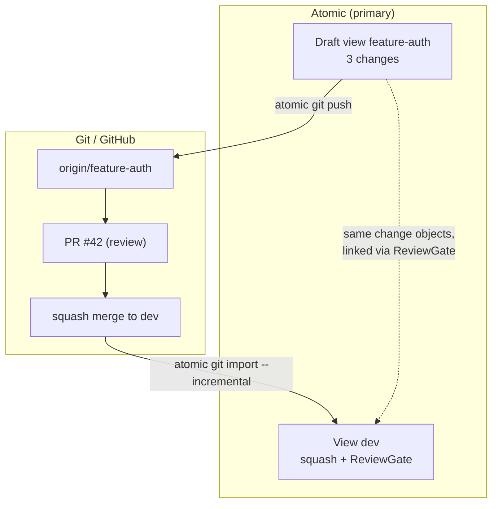
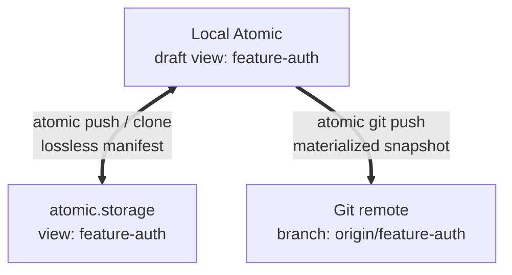
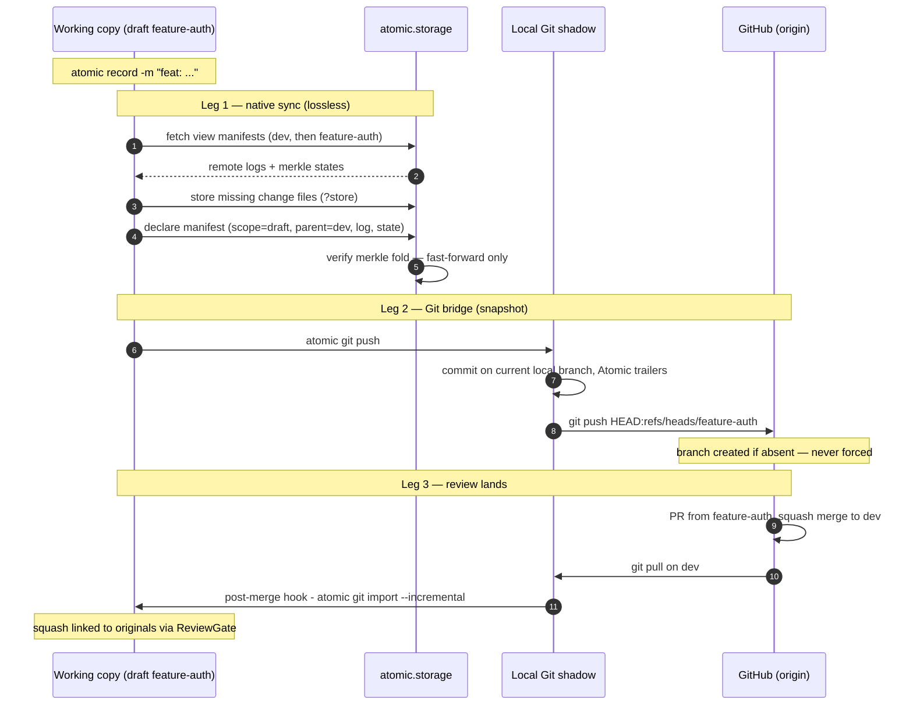
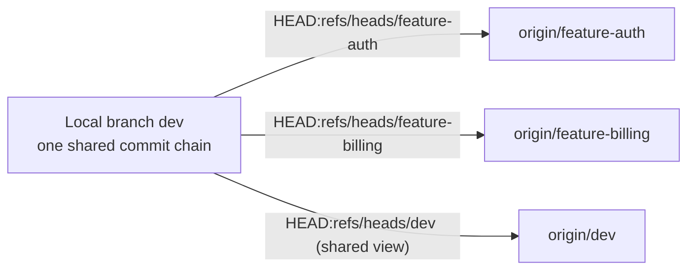

# Git Shadow Sync

Git Shadow Sync lets you run Atomic alongside Git so every commit, rebase, squash, and force-push is captured as immutable Atomic provenance. Git stays your primary collaboration platform — Atomic is a sidecar that observes, records, and preserves the true history that Git rewrites away.

Two commands keep the systems in sync:

- **`atomic git import`** — pulls Git commits into Atomic (automatic via hooks or manual)
- **`atomic git push`** — pushes Atomic changes out to Git with provenance trailers

You get Atomic's patch theory, AI attribution, and conflict-free views for daily development, while your team continues reviewing PRs on GitHub or GitLab exactly as before.

## How It Works

Both systems share the same working directory. Each ignores the other's internal state automatically:

| System | Ignores | How |
|--------|---------|-----|
| Git | `.atomic/`, `.vault/`, `.atomicignore` | `.git/info/exclude` (configured by `atomic git import`) |
| Atomic | `.git/` | Built-in exclusion (always ignored) |

```
┌─────────────────────────────────────────────────────────────┐
│                    Working Directory                         │
│                                                             │
│  .git/                        .atomic/                      │
│  ├── objects/                  ├── pristine.redb             │
│  ├── refs/                     ├── changes/                  │
│  └── hooks/                    └── config.toml               │
│      ├── post-commit ──────▶ atomic git import --incremental │
│      ├── post-merge  ──────▶ atomic git import --incremental │
│      ├── post-rewrite ─────▶ atomic git import --incremental │
│      └── post-checkout ────▶ warn if HEAD ≠ current view     │
│                                                             │
│  Atomic → Git:  atomic git push  (validated before commit)  │
│  Atomic → Git:  atomic view switch  (repoints Git branch)   │
│  Git → Atomic:  automatic (hooks) or manual (git import)    │
└─────────────────────────────────────────────────────────────┘
```

---

## Prefer Atomic over raw Git

**Git shadows Atomic — not the other way around.** Atomic is the source of truth for content and provenance; the Git repo is a downstream mirror that Atomic generates (materialize + `atomic git push`). Keep work flowing **Atomic → Git**:

| Instead of… | Use | Why |
|---|---|---|
| `git checkout <branch>` | `atomic view switch <view>` | Atomic materializes the view **and** repoints the Git branch to match |
| `git commit` of hand-edits | `atomic record`, then `atomic git push` | The shadow commit reflects a *recorded* Atomic state |
| pulling Git branches in by hand | `atomic git import` | The one deliberate Git → Atomic bridge (onboarding external commits) |

`atomic view switch` moves Git's `HEAD` to the matching branch automatically — a lightweight ref move that never re-renders your working copy — so `git branch` always agrees with your current view.

### You can't corrupt shared history

Raw Git commands aren't forbidden. If you use them and drift, the **shadow push refuses to publish an incoherent state**, so the mistake stays local. `atomic git push` validates the working copy *before* it ever creates a commit:

| Check | Refuses to commit when… | Fix |
|---|---|---|
| Conflict markers | a file still has `>>>>>>>` / `=======` / `<<<<<<<` | resolve them (or `atomic record --allow-conflict-markers` if they're real content) |
| Tree ↔ view coherence | the working copy diverges from the current view's recorded content | `atomic record` your changes first |
| Git ↔ Atomic lineage | the branch was last published from a state your view can't reach (drift) | reconcile — see below |
| Provenance paths | `.atomic/`, `.vault/`, or `.atomicignore` were about to be committed | automatic — they're never staged |

Every refusal leaves Git, the working copy, and the Atomic graph untouched, and — when run from a hook — logs a `shadow-validate:<rule>` line to `.atomic/hook-errors.log`.

### Reconcile-then-push (never force)

There is no `--force` that commits a drifted state — that escape hatch is what leads to corruption loops. To recover from drift, make the state coherent first, then push:

```bash
# Re-shadow: discard the drifted Git tip and regenerate from Atomic (the usual fix)
git reset --hard <last-good-shadow-commit>
atomic git push

# Or onboard: if the Git side has genuinely new authored work, import it first
atomic git import --incremental
atomic git push
```

---

## Initial Setup

Choose the scenario that matches your starting point.

### From an Existing Git Repo

You have a Git repository and want to add Atomic alongside it.

#### 1. Import Git history

```bash
cd /path/to/your/git/repo

# Import the current branch's history
atomic git import
```

This converts each Git commit into an Atomic change, preserving author, timestamp, and message. It also:

- Creates the `.atomic/` repository
- Populates the `GIT_SHA_INDEX` for fast incremental dedup
- Configures `.git/info/exclude` to ignore Atomic internal state
- Auto-detects project type for `.atomicignore`

:::info
By default, `atomic git import` walks the **first-parent** history of the current branch. Use `--all` to import all reachable commits — including those inside merged PRs that first-parent traversal skips. This matters for [preserving attribution through squash merges](#why-original-commits-survive).
:::

#### 2. Install hooks for automatic sync

```bash
atomic git hooks install
```

This installs `post-commit`, `post-merge`, and `post-rewrite` hooks. Every Git operation now records into Atomic automatically.

#### 3. Verify

```bash
atomic git hooks status     # all 3 should show "installed"
atomic log                  # imported changes
atomic status               # should be clean
```

#### Import options

```bash
# Import a specific branch
atomic git import --branch main

# Import all reachable commits (including inner-PR commits)
atomic git import --all

# Preview without creating anything
atomic git import --dry-run

# Skip vault initialization
atomic git import --no-vault

# Pre-build semantic layer for token-level blame on imported history
atomic git import --with-crdt
```

:::warning `--all` can produce materialization conflicts
The `--all` flag imports every reachable commit, including commits from **both sides of merge commits**. If those branches had overlapping edits (which is normal — that's why they were merged), Atomic's graph will contain conflicting changes. When the working copy is materialized, Atomic writes conflict markers into the affected files.

**Why this happens:** Consider a merge in git:

```
A───B───C───M───  (main)
     \     /
      D───E      (feature branch)
```

First-parent import walks `A → B → C → M`. Each commit is diffed against its parent — a linear chain with no conflicts. But `--all` also imports D and E. Both C and D descend from B, so if both modified the same file, Atomic creates two changes that edit the same graph vertices — genuinely conflicting operations.

Git's merge commit M resolved that conflict, but the import doesn't understand it that way. It treats M as just another commit (diffed against its first parent C). It doesn't tell Atomic "M resolves the conflict between C and D." In native Atomic workflows, conflicts are resolved explicitly in the graph at insert time — but imported merge commits don't carry that resolution.

The default first-parent import avoids this entirely. Use `--all` only when you need to preserve individual PR commit attribution through squash merges, and be prepared to [resolve materialization conflicts](#--all-import-produced-conflict-markers) afterward.
:::

### From an Existing Atomic Repo

You have an Atomic repository and want to add a Git remote for GitHub/GitLab code review.

#### 1. Initialize Git and add a remote

```bash
cd /path/to/your/atomic/repo

git init
git remote add origin git@github.com:org/repo.git
```

#### 2. Create the initial Git commit

Push the current Atomic state into Git:

```bash
atomic git push --no-push -m "Initial sync from Atomic"
```

This stages all working copy files, creates a commit with Atomic provenance trailers, and skips the remote push so you can inspect first.

#### 3. Configure shadow excludes

Tell Git to ignore Atomic internals. Create or update `.git/info/exclude`:

```bash
cat >> .git/info/exclude << 'EOF'

# Atomic local state (managed by atomic git import)
/.atomic/
/.vault/
/.atomicignore
EOF
```

:::tip
`atomic git import` writes these excludes automatically. When starting from an Atomic repo you haven't imported from Git, add them manually as shown above.
:::

#### 4. Install hooks and push

```bash
atomic git hooks install
git push -u origin main
```

### Both Repos Exist But Aren't Connected

Use this path when the project already has history on both remotes and you are
setting up a new local checkout. Start from Git so Git owns the working tree,
then bootstrap Atomic into that same directory.

```bash
# 1. Clone the Git repository and enter its worktree
git clone git@github.com:org/project.git project
cd project

# 2. Download and insert the existing Atomic view without rewriting Git files
atomic clone https://atomic.example.com/org/project/code . \
  --into-existing --view dev

# 3. Import Git commits that are not already represented in Atomic
atomic git import --incremental

# 4. Keep future Git changes synchronized automatically
atomic git hooks install
```

`atomic clone --into-existing` downloads every change in the selected remote
Atomic view and inserts it into the local Atomic repository. It does **not**
materialize the Atomic view over the Git checkout, so `.git/` and the files
selected by Git remain intact. The incremental import then adds Git-only
commits to the same local Atomic graph.

Use your team's shared Atomic view in place of `dev`. The target must be the
root of an existing, non-bare Git worktree, and it must not already contain an
`.atomic/` repository.

#### Verify

```bash
atomic log                  # includes remote Atomic changes and Git imports
git status                  # remains Git's checkout
atomic git hooks status     # all 3 should show "installed"
```

Bootstrap is complete once both histories are local. From this point forward,
follow the normal workflow below: create and record feature work in Atomic,
then use `atomic git push` to publish it for Git review. Git remains the
collaboration shadow and imports externally created Git commits through the
installed hooks.

---

## The Development Workflow

Once shadow sync is set up, here's a typical week.

### Day 1–2: Build the feature

```bash
# Create a draft view for your work
atomic view create feature-auth --draft --parent dev

# Write code, record changes in Atomic
atomic add src/auth.rs
atomic record -m "feat: add OAuth2 provider"

# More work...
atomic record -m "feat: add token refresh logic"
atomic record -m "test: add auth integration tests"
```

### Day 3: Push to Git for review

```bash
# Still on the draft view — push straight to Git
atomic git push -m "feat: OAuth2 authentication"
# → Pushed to origin/feature-auth
```

Because `feature-auth` is a **draft view**, the push targets a Git branch named after the view and creates `origin/feature-auth` on the first push. Open a PR from `feature-auth` into `dev` on GitHub or GitLab as usual — no `insert` into `dev` needed before review.

If you also collaborate through atomic.storage, publish the draft with full identity too:

```bash
atomic push        # declares the draft's manifest (scope, parent, change log)
```

See [Draft Views Across Both Remotes](#draft-views-across-both-remotes) for how the two remotes relate.

:::tip Shared views
On a shared view like `dev`, `atomic git push` keeps the classic behavior: the commit is pushed to the currently checked-out Git branch. The older flow — `atomic insert from-view feature-auth` into `dev`, then pushing `dev` — still works and remains useful when you want to batch several drafts into one commit.
:::

### Day 4: After the PR merges

```bash
# Pull the squash-merged commit back into Atomic
atomic git import --incremental

# The squash commit is imported and linked to your original changes
# via a ReviewGate tag
```

### The full cycle



---

## Draft Views Across Both Remotes

A draft view lives in **three places at once**, and each replica carries a different amount of information. The view **name is the mapping key** across all three:

| Replica | What it holds | Sync command |
|---------|---------------|--------------|
| **Local Atomic** (`.atomic/`) | Full patch identity: scope (`draft`), parent (`dev`), ordered change log, Merkle state | — |
| **atomic.storage** | The same identity, declared as a **view manifest** (lossless) | `atomic push` / `atomic clone` |
| **Git remote** | A **snapshot branch named after the view** — materialized files plus provenance trailers (lossy by design) | `atomic git push` |

So draft view `feature-auth` ⇄ storage view `feature-auth` ⇄ `origin/feature-auth`. You never create the remote counterparts by hand — both are created on first push.



### Why two remotes

- **atomic.storage is lossless.** The view manifest declares the draft's scope, parent name, exact ordered change log (including the prefix inherited from its parent at fork time), and Merkle state. A teammate who clones gets the draft back byte-for-byte — still a draft, still parented on `dev`.
- **The Git branch is lossy on purpose.** Reviewers see an ordinary branch and open an ordinary PR. Draft identity (scope, parent, patch structure) never exists in Git — the provenance trailers on each commit are the thread that links the branch back to the Atomic view and state that produced it.

### The end-to-end flow



Step by step:

1. **Record on the draft.** Work happens on `feature-auth` as usual. Nothing syncs until you push.
2. **`atomic push` → atomic.storage.** The parent chain is synced **root → leaf** (`main` → `dev` → `feature-auth`), so a draft's parent always exists on the server before the draft's manifest references it. For each view, the client fetches the remote manifest, uploads only the missing change files, then declares the local manifest. The server creates the view (with the declared scope and parent) if it's absent, fast-forwards its log, and verifies the Merkle state against the actual change bytes — it never trusts the client's claims.
3. **`atomic git push` → Git.** Because the current view is a draft and no `--branch` was given, the target defaults to the view name. The commit is created **on the current local Git branch** (Atomic never checks out or switches Git branches — Atomic owns the working copy) and pushed as `HEAD:refs/heads/feature-auth`. The first push creates `origin/feature-auth`; subsequent pushes fast-forward it. Force-pushes are never issued.
4. **Review and merge on the forge.** The PR is opened from `feature-auth` exactly as with any Git branch. On squash merge, the `Atomic-Changes` trailer makes [squash detection](#squash-merge-detection) exact.
5. **Import closes the loop.** The merge lands on `origin/dev`, a `git pull` fires the `post-merge` hook, and `atomic git import --incremental` records the squash into the `dev` view with a ReviewGate tag linking it to the original draft changes. Commits that `atomic git push` itself created are recognized by their trailers and skipped — no circular import.

### How the branch mapping works

The local Git branch and the remote branch are deliberately **decoupled**:



- Every bridge commit chains onto the **one local branch**, whatever it's named. `atomic git push` only redirects the **push refspec** — it never renames, creates, or checks out local Git branches, and never writes upstream-tracking config.
- The `Atomic-View` trailer on each commit records which view produced it. That's how the bridge finds, per view, which Atomic changes are already pushed (it walks local history for the last commit with a matching trailer and reads its `Atomic-State`).
- "Unpushed" detection for a draft compares local `HEAD` against `refs/remotes/origin/<view>` — so a failed network push is retried correctly on the next run, and pushing a draft with nothing new still creates the remote branch if it's missing.

:::warning Interleaving multiple drafts
Because all bridge commits share one local chain, a PR opened from a draft branch can list snapshot commits from *other* drafts in its commit list (the **diff** against the base is always correct — it's the draft's materialized state). If your team reads PR commit lists, prefer landing one draft at a time, or squash-merge PRs (the default in this workflow).
:::

### Rules that keep the three replicas in sync

| Rule | Enforced by |
|------|-------------|
| Storage sync is fast-forward only; divergence is a hard error (`--force` exists, identity conflicts still rejected) | server-side manifest verification |
| Parents sync before children (root → leaf) | `atomic push` chain walk |
| Scope and parent cannot silently change on the remote | manifest identity check |
| Git branch is never force-pushed; divergence surfaces as a normal Git rejection | `atomic git push` |
| The local Git branch and working copy are never touched by the bridge | `atomic git push` (refspec redirection only) |
| A draft view name that isn't a valid Git refname is a hard error, never a silent rename | `atomic git push` |

### Picking up a teammate's draft

```bash
# Full fidelity — the draft arrives as a draft, parented on dev:
atomic clone https://acme.atomic.storage/workspace/ws/project/proj my-checkout
atomic view switch feature-auth

# Snapshot only — ordinary git, no Atomic identity:
git fetch origin feature-auth
```

`atomic clone` walks the manifest chain (leaf → root to discover, applied root → leaf) and reconstructs scope, parent, and the exact change log. The Git branch alone gives you files and trailers — enough to review, not enough to continue the draft natively.

:::note
`atomic pull` does not yet apply view manifests for drafts — draft identity currently round-trips through `push` and `clone`. Refreshing an existing checkout's drafts via `pull` is a known follow-up.
:::

### Landing and cleaning up

```bash
# After the PR merges and the import closes the loop:
atomic view switch dev
atomic view delete feature-auth      # local draft
# origin/feature-auth — delete on the forge (or automatically with the PR)
# storage view feature-auth — keep for audit, or delete via the storage API
```

Nothing is lost by cleanup: the changes live on in `dev` (they were the same objects all along — views are filters, not copies), the ReviewGate tag preserves the link to the squash commit, and atomic.storage retains the full provenance graph.

---

## `atomic git push`

Materializes your Atomic state into a Git commit and optionally pushes it.

**What it does:**

1. Resolves the target Git branch — `--branch` if given; otherwise the **draft view's name** when the current view is a draft; otherwise the current Git branch
2. Stages all files (`git add -A` — new files, modifications, and deletions)
3. Compares against Git HEAD — skips commit if nothing changed
4. Creates a commit with Atomic provenance trailers (always on the current local branch — it never checks out or switches Git branches)
5. Pushes `HEAD:refs/heads/<target>` to the Git remote (unless `--no-push`), creating the remote branch if it doesn't exist — never force-pushed

### Provenance trailers

Every commit created by `atomic git push` includes trailers that link back to Atomic:

```
feat: OAuth2 authentication

Atomic-View: dev
Atomic-State: WQISSJNOSUK3K7DAN5RR4S4J6AFXBEJDGULHMTFTBR2X7EQ2WI2A
Atomic-Changes: ABC123, DEF456, GHI789
```

| Trailer | Purpose |
|---------|---------|
| `Atomic-View` | Which Atomic view produced this commit |
| `Atomic-State` | The view's Merkle state hash at commit time |
| `Atomic-Changes` | The Atomic change hashes included (last 10 shown for large sets) |

These trailers enable audit trails, sync verification, and exact squash-merge detection on re-import.

### Flags

| Flag | Description |
|------|-------------|
| `-m "message"` | Set the Git commit message |
| `--no-push` | Create the commit but don't push to the remote |
| `--remote origin` | Specify which Git remote to push to (default: `origin`) |
| `--branch <name>`, `-b` | Push to a specific remote branch. Defaults to the **view name** on draft views, or the current Git branch on shared views |

### Examples

```bash
# Push with a custom message
atomic git push -m "feat: add user dashboard"

# On a draft view: publishes to a remote branch named after the view,
# creating it on the first push
atomic view switch feature-auth
atomic git push -m "feat: OAuth2 authentication"
# → Pushed to origin/feature-auth

# Create a commit without pushing (inspect first)
atomic git push --no-push
git log -1 --format="%B"    # inspect trailers

# Push to a specific remote
atomic git push --remote upstream

# Override the target branch explicitly
atomic git push --branch pr-42
```

:::info Draft view names must be valid Git refnames
When a draft view's name can't be used as a Git branch name (spaces, `~`, `^`, `:`, etc.), `atomic git push` fails with a clear error instead of silently renaming. Pass `--branch` to choose an explicit target.
:::

---

## Git Hooks

Git hooks keep Atomic automatically in sync with Git. Every `git commit`, `git merge`, and `git rebase` fires a hook that imports new commits into Atomic.

### Installing hooks

```bash
atomic git hooks install
```

This installs four hooks:

| Git event | Hook | Action |
|-----------|------|--------|
| `git commit` | `post-commit` | `atomic git import --incremental` |
| `git merge` / `git pull` | `post-merge` | `atomic git import --incremental` |
| `git rebase` / `git commit --amend` | `post-rewrite` | `atomic git import --incremental` |
| `git checkout <branch>` | `post-checkout` | **warn-only**: if Git HEAD no longer matches the Atomic view, print a resync hint |

The first three import new Git commits into Atomic. The `post-checkout` hook is **advisory only** — it mutates nothing (no switch, no import, no commit); it just reminds you when a raw `git checkout` moved Git off your current Atomic view:

```text
atomic: git is on 'feature-x' but the Atomic view is 'dev';
        run 'atomic view switch feature-x' to resync (or 'atomic git import' to onboard git-side work).
```

All hooks fail silently (`|| true`) so Git operations never break, even if Atomic has an issue.

### Coexisting with existing hooks

Hooks are installed between markers so they don't interfere with other hook content:

```bash
#!/bin/sh
echo "my existing hook"      # preserved

# atomic:git:begin
atomic git import --incremental 2>/dev/null || true
# atomic:git:end
```

Uninstalling removes only the Atomic section — everything else stays intact.

### Managing hooks

```bash
atomic git hooks install     # add Atomic sections (idempotent)
atomic git hooks uninstall   # remove only Atomic sections
atomic git hooks status      # show per-hook status
```

:::info
Import is idempotent — running it twice on the same commits is harmless. Already-imported SHAs are skipped via the `GIT_SHA_INDEX`.
:::

---

## Squash Merge Detection

When a PR is squash-merged on GitHub or GitLab, the original commits are collapsed into one. `atomic git import --incremental` detects this automatically:

1. **Imports** the squash commit as a regular Atomic change
2. **Detects** the squash by parsing the commit message for forge-specific patterns or `Atomic-Changes` trailers
3. **Creates a ReviewGate tag** linking the squash commit back to the original Atomic changes

### Why Original Commits Survive

In Git, a squash merge **destroys** the original commits — they become unreachable and are eventually garbage collected. The individual authors, messages, and diffs are replaced by a single squash commit, often under a different committer name.

In Atomic, those original commits were already imported as individual changes in the canonical GRAPH. Every change is content-addressed and immutable — once it's in the graph, it can't be deleted or rewritten. The squash merge is imported as a **new** change linked to the originals via a ReviewGate tag, but the originals remain fully intact:

```
Git (after squash merge):                Atomic (after import):

abc "feat: auth" (Alice)    ← GC'd       Change A "feat: auth" (Alice)    ← still here
def "feat: api"  (Bob)      ← GC'd       Change B "feat: api"  (Bob)      ← still here
ghi "add tests"  (Alice)    ← GC'd       Change C "add tests"  (Alice)    ← still here
                                                    │
xyz "Add auth (#42)" (merger) ← only      Change D "Add auth (#42)"  ← imported
                                survivor         └── ReviewGate: D absorbed {A, B, C}
```

This means individual developer attribution survives squash merges. If Alice wrote the auth logic and Bob wrote the API, that's preserved in the Atomic graph even after the PR is squash-merged under a single committer name on GitHub.

:::warning `--all` import: tradeoff between attribution and conflicts
The default import (`atomic git import`) uses **first-parent** traversal, which imports only the mainline commits — including the squash commit itself, but **not** the individual PR commits it replaced. This is safe and conflict-free.

Use `atomic git import --all` to import every reachable commit, including those inside merged PRs. This preserves individual attribution, but can produce [materialization conflicts](#--all-import-produced-conflict-markers) when branches had overlapping edits. See the troubleshooting section for the recovery procedure.
:::

### Supported forge formats

| Forge | Commit message pattern | Example |
|-------|----------------------|---------|
| GitHub | `title (#42)\n\n* commit 1\n* commit 2` | `feat: auth (#42)` |
| GitLab | `title\n\nSee merge request group/project!55` | `See merge request acme/api!55` |
| Azure DevOps | `Merged PR 42: title` | `Merged PR 42: feat: auth` |
| Bitbucket | `Merged in branch (pull request #42)` | `Merged in feature-auth (pull request #42)` |

:::tip
If your commit message includes `Atomic-Changes` trailers (from `atomic git push`), detection is exact — no pattern matching needed.
:::

## ReviewGate Tags

A ReviewGate is a semantic tag that records "this set of changes was reviewed and approved." It's created automatically when a squash merge is detected during import.

### What they contain

```json
{
  "type": "review-gate",
  "changes": ["ABC123", "DEF456", "GHI789"],
  "git": {
    "sha": "abc123def456...",
    "merge_strategy": "squash",
    "pr_number": 42
  }
}
```

### Viewing ReviewGate tags

```bash
# List all tags including ReviewGates
atomic tag list

# Show details for a specific ReviewGate
atomic tag show pr-42
```

ReviewGates serve as audit checkpoints — you can trace any Atomic change back to the PR where it was reviewed, and from any PR back to the original fine-grained changes that composed it.

---

## The DEV Update Problem (Solved)

In pure Git, squash merges create a well-known pain point:

```bash
# Git: after squash-merging feature into main...
git checkout dev
git merge main
# CONFLICT! The squash commit and dev's history diverged permanently.
# dev has the original commits; main has the squash. They'll never reconcile.
```

Long-lived branches like `dev` accumulate permanent divergence from `main` after every squash merge. Teams resort to periodic "reset dev from main" operations that destroy in-flight work.

**This problem doesn't exist in Atomic.** Both views share the same underlying change objects in the graph. The squash commit is imported as a new change, but the original changes are still present and visible through their views. There's no divergence because views are filters on a single canonical graph, not independent histories.

```bash
# Atomic: after squash merge is imported
atomic view switch dev
atomic status
# Clean. The original changes are already here.
# The imported squash commit is linked via ReviewGate.
```

---

## Syncing Tags to atomic.storage

ReviewGate tags and other Atomic tags sync automatically with your Atomic remote:

```bash
# Push uploads tags as content-addressed blobs
atomic push

# Pull downloads tags listed for the remote view
atomic pull
```

Tags are content-addressed, so duplicates are automatically deduplicated. A tag pushed from one machine is available on every other machine after `atomic pull`.

---

## GIT_SHA_INDEX

Under the hood, `atomic git import` maintains a redb table called `GIT_SHA_INDEX` that maps Git SHA → Atomic `entity_id`. This index:

- Makes `--incremental` **O(1) per commit** — checks the index to skip already-imported SHAs
- Is **backfilled automatically** on the first `--incremental` run for repos imported before the index existed
- Lives inside `.atomic/pristine.redb` alongside the rest of the Atomic database

You never need to interact with this index directly. It's an implementation detail that makes incremental import fast.

---

## Troubleshooting

### Incremental import reports "No commits to import"

This is correct behavior — all Git commits are already imported. The `GIT_SHA_INDEX` confirmed every SHA is present. No action needed.

### Git shows all files as untracked after setup

Git has no local branch pointing to commits. Follow the [Both Repos Exist But Aren't Connected](#both-repos-exist-but-arent-connected) steps to wire up a local branch without clobbering Atomic's working tree.

### Git shows files as modified after setup

The Atomic working tree has changes that were never committed to Git. Sync them:

```bash
atomic git push --no-push -m "sync: align Git with Atomic"
```

### Git refuses checkout with "untracked files would be overwritten"

Don't use `git checkout` when files already exist from Atomic. Use the `update-ref` + `symbolic-ref` + `reset` sequence described in [setup](#both-repos-exist-but-arent-connected).

### Squash merge not detected

The commit message doesn't match any known forge format, and no `Atomic-Changes` trailer was found. The commit is still imported as a regular Atomic change — it just won't get a ReviewGate tag.

**Fix:** Use `atomic git push` to create your Git commits. It adds `Atomic-Changes` trailers automatically, which makes detection exact.

### Force-push on a branch

Existing Atomic changes are preserved — nothing is lost. Force-pushes only affect Git's ref pointers. On the next `atomic git import --incremental`, the new commits at the force-pushed ref are imported fresh. Old commits that were replaced in Git still exist as Atomic changes.

### Git and Atomic are out of sync

```bash
# Re-sync by running an incremental import
atomic git import --incremental

# If that doesn't help, verify both sides
git log --oneline -10
atomic log
```

:::warning
Never delete `.atomic/` and re-import as a "fix." This destroys all Atomic-native changes, ReviewGate tags, and view structure that don't exist in Git. Run `atomic git import --incremental` instead.
:::

### `--all` import produced conflict markers

`atomic git import --all` imports commits from both sides of merge commits. When those branches had overlapping edits, Atomic's graph contains conflicting changes, and materialization writes conflict markers into the affected files:

```
>>>>>>> 1 [ABCD1234]
Content from one branch
======= 1
Content from the other branch
<<<<<<< 1
```

`atomic git push` **refuses to commit in this state** — the shadow-push validator (conflict-marker check) aborts with no commit and points you at the offending file and line. Your Git history is never polluted with markers.

**To recover:**

```bash
# 1. Restore the clean working tree from git
git reset --hard origin/dev     # or whatever your clean branch is

# 2. Record the clean state into Atomic to resolve the conflicts
atomic add -A
atomic record -m "fix: resolve materialization conflicts from --all import"

# 3. Verify both systems are clean
atomic status                   # should be clean
git status                      # should be clean
cargo build --release           # should pass (for Rust projects)
```

This works because git's first-parent history has the correct merged result of every PR. Recording that clean state into Atomic resolves the graph conflicts by accepting the merged outcome.

:::tip Avoiding this in the future
For most workflows, the default first-parent import is sufficient and conflict-free. Use `--all` only when you specifically need individual PR commit attribution to survive squash merges, and always check for conflict markers before pushing.
:::

### Circular import concern

The hooks run `atomic git import --incremental` which creates Atomic changes from Git commits. But `atomic git push` creates Git commits from Atomic changes. Won't this loop?

No — `atomic git push` creates a commit with provenance trailers, and the next incremental import indexes that commit's SHA. If you push and the hook fires, the import sees the SHA is already indexed and skips it. The `GIT_SHA_INDEX` prevents circular recording.

---

## Quick Reference

```bash
# ── From Git repo, add Atomic ──────────────────────
atomic git import                      # import history
atomic git hooks install               # auto-sync

# ── From Atomic repo, add Git ──────────────────────
git init && git remote add origin URL
atomic git push --no-push -m "init"    # create first commit
atomic git hooks install               # auto-sync
git push -u origin main

# ── Both exist, not connected ──────────────────────
git fetch origin                       # if no remote branches yet
git update-ref refs/heads/dev refs/remotes/origin/dev
git symbolic-ref HEAD refs/heads/dev
git reset
atomic git push --no-push -m "sync"    # align working trees
atomic git hooks install               # auto-sync

# ── Day-to-day ─────────────────────────────────
# Git commits auto-import via hooks
atomic git push                        # push Atomic → Git
                                       #   draft view → origin/<view-name>
                                       #   shared view → current git branch
atomic git push --branch pr-42         # explicit target branch
atomic git import --incremental        # manual Git → Atomic
atomic push                            # draft identity → atomic.storage

# ── Hook management ────────────────────────────────
atomic git hooks install               # idempotent
atomic git hooks uninstall             # removes only Atomic sections
atomic git hooks status                # show per-hook status
```

## Next Steps

- [Migrating from Git](./migrating-from-git) — full migration guide if you want to go Atomic-only
- [AI Agent Workflows](./ai-agent-workflows) — using agents with Atomic's provenance tracking
- [Querying the Graph](./querying-the-graph) — explore your repository with knowledge graph queries
