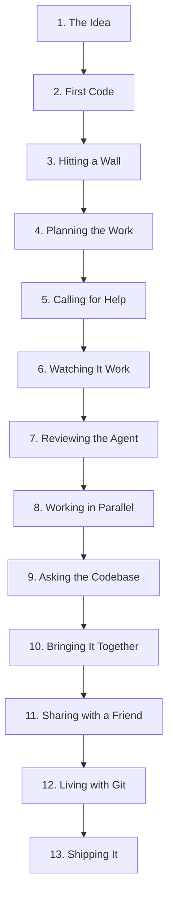

# Atomic CLI — Video Walkthrough Series

> **The story:** You have an idea for an app — a recipe-sharing website called "Potluck." You start alone with a README, build the first pages by hand, realize the scope is bigger than you thought, and bring in an AI coding agent to help. Together, you ship it.
>
> 13 episodes, 30–60 seconds each. One continuous project. Every command is real.

---

## The Arc



| Act | Episodes | What happens |
|-----|----------|--------------|
| **I — Solo** | 1–3 | You start the project, write code, hit the limits of doing it alone |
| **II — Human + Agent** | 4–7 | Break work into intents, bring in Claude, watch it work, review what it did |
| **III — Scaling Up** | 8–10 | Parallel agents, interrogate the codebase, merge everything |
| **IV — The World** | 11–13 | Collaboration, Git interop, deployment |

---

## Episode 1 — "The Idea" (30s)

**What happens:** You have an idea for Potluck, a recipe-sharing site. You create the project and write the README.

**On screen — you talking:**
> "I've got an idea for an app. A recipe-sharing site called Potluck. Let me start the way I always start — with a README."

### Commands

```bash
# Start the project
mkdir potluck && cd potluck
atomic init --kind node
# → Initialized empty Atomic repository in .atomic/
# → Created view: dev

# Write the README
cat > README.md << 'EOF'
# Potluck 🍲

A recipe-sharing website where friends bring their best dishes.

## Features (planned)
- Browse and search recipes
- Submit your own recipes with photos
- Rate and comment
- Weekly "potluck picks" homepage
EOF

# Track it and record
atomic add README.md
atomic record -m "Project idea: Potluck recipe-sharing site"
# → Recorded change XMJZ3IPF (1 file, 1 addition)
```

**You, to camera:** "That's it. One file, one change. We're building."

---

## Episode 2 — "First Code" (45s)

**What happens:** You write the first real code — a landing page and a recipe data model. You make mistakes, fix them, check what changed.

**On screen — you talking:**
> "Let me rough out the landing page. I'm a backend person, so this HTML is going to be... rustic."

### Commands

```bash
# Create the landing page
mkdir -p src
cat > src/index.html << 'EOF'
<!DOCTYPE html>
<html>
<head><title>Potluck</title></head>
<body>
  <h1>Potluck 🍲</h1>
  <p>Recipes from friends, for friends.</p>
  <div id="recipes"></div>
  <script src="app.js"></script>
</body>
</html>
EOF

# And a recipe model
cat > src/recipe.js << 'EOF'
export class Recipe {
  constructor(title, author, ingredients, steps) {
    this.title = title;
    this.author = author;
    this.ingredients = ingredients;
    this.steps = steps;
    this.createdAt = new Date();
  }
}
EOF

# Check what we've got
atomic status
# → Untracked: src/index.html
# → Untracked: src/recipe.js

# Track and record everything at once
atomic add src/
atomic record -m "Landing page and recipe model"

# Wait — I want a ratings field too
cat >> src/recipe.js << 'EOF'

export function rateRecipe(recipe, stars) {
  if (!recipe.ratings) recipe.ratings = [];
  recipe.ratings.push(stars);
  return recipe.ratings.reduce((a, b) => a + b) / recipe.ratings.length;
}
EOF

# See the diff
atomic diff
# → +export function rateRecipe(recipe, stars) {
# → +  if (!recipe.ratings) recipe.ratings = [];
# → ...

atomic record -m "Add recipe ratings"
```

**You, to camera:** "Three changes in. Landing page, data model, ratings. But if I'm honest... I'm going to need help with the rest."

---

## Episode 3 — "Hitting a Wall" (30s)

**What happens:** You look at the feature list and realize the scope is enormous. You check your history, see how far you've come — and how far you have to go.

**On screen — you talking:**
> "Let me see where I stand."

### Commands

```bash
# Check the history
atomic log
# → #3  W9LP...  Add recipe ratings                  2m ago
# → #2  RTKF...  Landing page and recipe model       5m ago
# → #1  XMJZ...  Project idea: Potluck recipe site   8m ago

# Look at the README again
cat README.md
# → ## Features (planned)
# → - Browse and search recipes       ← not started
# → - Submit your own recipes         ← barely started
# → - Rate and comment                ← rating done, no comments
# → - Weekly "potluck picks" homepage ← not started

# Inspect the latest change
atomic change
# → Change:   W9LP7KDM
# → Author:   you <you@example.com>
# → Files:    Modified: src/recipe.js (+8 lines)
```

**You, looking at the feature list:**
> "Search, submissions, comments, a whole homepage... I need help. What if I brought in an AI agent?"

---

## Episode 4 — "Planning the Work" (45s)

**What happens:** You decide to get organized before bringing in help. You initialize the vault, write down what you know about the project, and break the remaining work into intents.

**On screen — you talking:**
> "Before I ask for help, I need to plan. Atomic has a vault — a versioned knowledge store that lives alongside the code. I'll write down the architecture, then break the remaining features into tasks called intents."

### Commands

```bash
# Initialize the vault — project memory
atomic vault init
# → ✓ Created .vault/ with default structure

# Store what I know about the stack
atomic vault memory write stack << 'EOF'
# Stack
- Vanilla JS, no framework
- Single-page app with client-side routing
- File-based storage (JSON) for MVP
- No build step — just serve src/
EOF

# Break the remaining work into intents
atomic vault intent create --title "Build recipe submission form" -p high
# → Created intent: POTL-1
# →   file: .vault/intents/POTL-1.md

atomic vault intent create --title "Full-text recipe search" -p high
# → Created intent: POTL-2

atomic vault intent create --title "Comments on recipes" -p medium
# → Created intent: POTL-3

atomic vault intent create --title "Weekly potluck picks homepage" -p low
# → Created intent: POTL-4

# See the backlog
atomic vault intent list
# →   POTL-1     backlog  high     —                Build recipe submission form
# →   POTL-2     backlog  high     —                Full-text recipe search
# →   POTL-3     backlog  medium   —                Comments on recipes
# →   POTL-4     backlog  low      —                Weekly potluck picks homepage

# Sync everything to the vault database
atomic vault sync
# → Synced 5 entries
```

**You, to camera:** "Four intents. Organized by priority. Now I know what needs to happen — and so will anyone I bring in to help."

---

## Episode 5 — "Calling for Help" (45s)

**What happens:** You enable Atomic's agent integration, assign the first intent to Claude, and kick off a goal.

**On screen — you talking:**
> "I'll take comments myself. But that submission form? Let's give it to Claude."

### Commands

```bash
# Enable agent integration — auto-detects Claude Code
atomic agent enable
# → ✓ Detected: claude-code
# → ✓ Installed hooks in .claude/settings.json
# → ✓ Created .atomic/sessions/

# Assign POTL-1 to the agent and mark it in-progress
atomic vault intent update POTL-1 --status in-progress --assignee claude
# → Updated intent: POTL-1
# →   status: in-progress
# →   priority: high
# →   assignee: claude

# Start a goal linked to the intent — tracks the work session
atomic vault goal start --intent POTL-1 --developer claude --model claude-sonnet-4
# → Started goal: swift-meadow-a3f2
# →   directory: .vault/goals/swift-meadow-a3f2

atomic vault sync
```

**You, to camera:** "The intent says *what* to build. The goal tracks *the session* where it gets built. Now when I open Claude Code, it has full context — the stack memo, the intent description, everything."

*Cut to: Claude Code session where you ask it to build the recipe submission form.*

---

## Episode 6 — "Watching It Work" (45s)

**What happens:** The agent session ends. You close out the goal, mark the intent done, and check what it did — not by reading a chat log, but by using Atomic's history and provenance tools.

**On screen — you talking:**
> "The agent is done. But here's what's different about Atomic — I don't have to trust a chat log. Every turn the agent took was automatically recorded as a signed change. Let me see what happened."

### Commands

```bash
# What changed since I last looked?
atomic log
# → #6  T5NF...  [agent] Add form validation and error handling  1m ago
# → #5  M9QR...  [agent] Recipe submission form with preview     3m ago
# → #4  P3KL...  [agent] Create recipe submission component      5m ago
# → #3  W9LP...  Add recipe ratings                              20m ago

# Three agent turns. Let me see the details on one.
atomic change T5NF -p
# → Change:      T5NF4B2Q
# → Author:      claude-code (delegated by you)
# → Message:     Add form validation and error handling
# →
# → AI Provenance:
# →   Vendor:  Anthropic
# →   Model:   claude-sonnet-4-20250514
# →   Tool:    Claude Code
# →   Tokens:
# →     Input:  8,240
# →     Output: 2,180
# →     Total:  10,420
# →   Cost:    $0.0523
# →   Session: sess_abc123
# →
# → Files:
# →   + src/submit.html (new, 42 lines)
# →   + src/validate.js (new, 28 lines)
# →   ~ src/index.html  (modified, +3 lines)

# Close out the goal and mark the intent done
atomic vault goal stop --promote
# → Completed goal: swift-meadow-a3f2

atomic vault intent update POTL-1 --status done
# → Updated intent: POTL-1
# →   status: done

atomic vault intent list
# →   POTL-1     done     high     claude           Build recipe submission form
# →   POTL-2     backlog  high     —                Full-text recipe search
# →   POTL-3     backlog  medium   —                Comments on recipes
# →   POTL-4     backlog  low      —                Weekly potluck picks homepage
```

**You, to camera:** "Model, tokens, cost, session — all embedded in the change. Intent done. Goal completed. I can review AI work the same way I review human work."

---

## Episode 7 — "Reviewing the Agent" (30s)

**What happens:** You use the attestation summary to get a project-level view of AI vs. human authorship, then check the agent session status.

**On screen — you talking:**
> "Before I keep going, let me see the big picture. How much of this project is AI-written?"

### Commands

```bash
# Project-level AI authorship summary
atomic agent attest --summary
# → Project: dev
# →
# → AI-authored: 50% (3 of 6 authored changes)
# → Human-authored: 3 changes
# → AI sources: Anthropic 3
# → Tools: Claude Code 3

# Check the session details
atomic agent status --verbose
# → Agent Integration Status
# → =======================
# →
# →   ✓ Claude Code — hooks installed
# →
# →   Recent sessions (1 total):
# →     ○ sess_abc123 (Claude Code, 3 turns, 8m)
# →       View: dev
# →       Model: claude-sonnet-4-20250514
# →       Files touched: 3 (src/submit.html, src/validate.js, src/index.html)
# →
# →   Total: 1 session, 3 turns, 3 files touched
```

**You, to camera:** "Half the code is mine, half is Claude's. Every line is attributed. Now let's go faster."

---

## Episode 8 — "Working in Parallel" (60s)

**What happens:** Two intents left to tackle. You take comments, Claude takes search. You work at the same time in separate sandboxes.

**On screen — you talking:**
> "Two high-priority intents left. I'll take comments, Claude gets search. We work at the same time — separate sandboxes, same graph."

### Commands

```bash
# Assign the intents
atomic vault intent update POTL-3 --status in-progress --assignee you
atomic vault intent update POTL-2 --status in-progress --assignee claude

# Create a view for comments (I'll do this one)
atomic view create comments --draft --parent dev
# → Created view 'comments' (draft, parent: dev)

# Create a sandbox for the agent to work on search
atomic sandbox create search-agent --from dev
# → Sandbox 'search-agent' created
# →   Working tree: ../potluck-sandboxes/search-agent
# →   View:         search-agent (new draft from 'dev')
# →   Files cloned: 6 (copy-on-write where supported)
# →   Graph:        shared (canonical potluck/.atomic)

# Switch to my view and start on comments
atomic view switch comments

cat > src/comments.js << 'EOF'
export class Comment {
  constructor(recipeId, author, text) {
    this.recipeId = recipeId;
    this.author = author;
    this.text = text;
    this.createdAt = new Date();
  }
}

export function addComment(recipe, comment) {
  if (!recipe.comments) recipe.comments = [];
  recipe.comments.push(comment);
  return recipe;
}
EOF

atomic add src/comments.js
atomic record -m "Comment model and addComment function"

# Meanwhile, in the sandbox, Claude is building search...
# (Cut to: the agent working in ../potluck-sandboxes/search-agent)

# Check what views exist now
atomic view list --verbose
# → * comments      [draft, parent: dev]      7 changes
# →   search-agent  [draft, parent: dev]      9 changes
# →   dev           [shared]                  6 changes
```

**You, to camera:** "I'm writing comments. Claude is building search. Same graph, different views, no conflicts."

---

## Episode 9 — "Asking the Codebase" (45s)

**What happens:** Before merging, you want to understand what the agent built. Instead of reading every file, you query the knowledge graph.

**On screen — you talking:**
> "Claude built the search feature in its sandbox. Before I merge it in, I want to understand what's there — without reading every line. Atomic has a knowledge graph. Let me ask it."

### Commands

```bash
# Build the knowledge graph from the current codebase
atomic query enrich
# → Indexed 8 files, 18 entities, 12 relationships

# What entities does the search module have?
atomic query entities src/search.js
# → Function  buildIndex        L1-12   pub
# → Function  searchRecipes     L14-28  pub
# → Function  highlightMatches  L30-45  pub

# Search for all code that touches "recipe"
atomic query code "recipe" -t javascript
# → src/recipe.js:1    export class Recipe {
# → src/search.js:14   export function searchRecipes(index, query) {
# → src/submit.html:8  <form id="recipe-form">
# → src/comments.js:2  constructor(recipeId, author, text) {

# How does search connect to the rest of the project?
atomic query neighbors "file:src/search.js"
# → ← defined_in ← function:buildIndex
# → ← defined_in ← function:searchRecipes
# → ← defined_in ← function:highlightMatches
# → → references → file:src/recipe.js
# → ← modifies  ← change:BN4F (Full-text recipe search with index)

# Ask a plain-English question — RAG over the knowledge graph
atomic query ask "how does the search indexing work?"
# → The search index is built by `buildIndex()` in src/search.js (L1-12).
# → It iterates all recipes, tokenizes the title and ingredients fields,
# → and builds an inverted index mapping tokens to recipe IDs.
# → `searchRecipes()` (L14-28) queries this index and returns ranked
# → results by token frequency.
# →
# →   — claude-sonnet-4 (2 turns, 3.1s, 1,240 in + 380 out tokens)
```

**You, to camera:** "I didn't read a single file. I asked the codebase, and it answered. Now I'm confident merging this in."

---

## Episode 10 — "Bringing It Together" (45s)

**What happens:** Both features are done. You preview what each view has, insert both into dev, and close out the intents.

**On screen — you talking:**
> "Two features, built in parallel. Time to bring them together."

### Commands

```bash
# Preview what the agent built
atomic insert preview search-agent --to-view dev
# → Would insert 3 changes into 'dev':
# →   1. [agent] Full-text recipe search with index
# →   2. [agent] Search results UI with highlighting
# →   3. [agent] Wire search to homepage

# Preview my work
atomic insert preview comments --to-view dev
# → Would insert 1 change into 'dev':
# →   1. Comment model and addComment function

# Insert both into dev
atomic insert from-view search-agent --to-view dev
# → Inserted 3 changes into 'dev'

atomic insert from-view comments --to-view dev
# → Inserted 1 change into 'dev'

# Close out the intents
atomic vault intent update POTL-2 --status done
atomic vault intent update POTL-3 --status done

atomic vault intent list
# →   POTL-1     done     high     claude           Build recipe submission form
# →   POTL-2     done     high     claude           Full-text recipe search
# →   POTL-3     done     medium   you              Comments on recipes
# →   POTL-4     backlog  low      —                Weekly potluck picks homepage

# Switch to dev and see the full picture
atomic view switch dev
atomic log
# → #10  QRM7...  [agent] Wire search to homepage              2m ago
# → #9   KLP3...  [agent] Search results UI with highlighting  3m ago
# → #8   BN4F...  [agent] Full-text recipe search with index   5m ago
# → #7   J8NF...  Comment model and addComment function        8m ago
# → #6   T5NF...  [agent] Add form validation                  30m ago
# → ...

# How much is AI now?
atomic agent attest --summary
# → AI-authored: 60% (6 of 10 authored changes)
# → Human-authored: 4 changes
```

**You, to camera:** "Ten changes. Six from the agent, four from me. Three of four intents done. All tracked, all attributed."

---

## Episode 11 — "Sharing with a Friend" (45s)

**What happens:** Your friend Jordan wants to contribute. You push to a remote, they clone it, and they pick up the last backlog intent.

**On screen — you talking:**
> "My friend Jordan wants to help. They'll take the last intent — weekly potluck picks."

### Commands

```bash
# Check your identity
atomic identity whoami
# → you (you@example.com)
# → Key: ED25519 VKQF3M...

# Set up a remote and push
atomic remote add origin https://you.atomic.storage/workspaces/personal/projects/potluck/code
atomic push
# → Uploaded 10 changes
# → View 'dev' synced

# --- Jordan's machine ---

atomic clone https://you.atomic.storage/workspaces/personal/projects/potluck/code
# → Cloning into 'potluck'...
# → Received 10 changes
# → Materialized view 'dev' (8 files)

cd potluck

# Jordan sees the backlog — one intent left
atomic vault intent list
# →   POTL-1     done     high     claude           Build recipe submission form
# →   POTL-2     done     high     claude           Full-text recipe search
# →   POTL-3     done     medium   you              Comments on recipes
# →   POTL-4     backlog  low      —                Weekly potluck picks homepage

# Jordan claims it
atomic vault intent update POTL-4 --status in-progress --assignee jordan

# Jordan works on weekly picks, pushes back...
# ...

# --- Back on your machine ---
atomic pull
# → Pulled 2 new changes from origin
# → #12  VP8N...  Weekly picks algorithm        (by jordan)
# → #11  RL3K...  Picks homepage component      (by jordan)

atomic vault intent list
# →   POTL-1     done     high     claude           Build recipe submission form
# →   POTL-2     done     high     claude           Full-text recipe search
# →   POTL-3     done     medium   you              Comments on recipes
# →   POTL-4     done     low      jordan           Weekly potluck picks homepage
```

**You, to camera:** "All four intents done. Three contributors — me, Claude, and Jordan. Every change signed and attributed."

---

## Episode 12 — "Living with Git" (60s)

**What happens:** Jordan's team uses GitHub for CI and PRs. You show that Atomic shadows Git — import, auto-sync, and push back with provenance.

**On screen — you talking:**
> "Jordan's team uses GitHub for CI. No problem — Atomic shadows Git."

### Commands

```bash
# Jordan's team has a Git repo. Import the full history.
cd potluck-github
atomic git import --all
# → Importing Git repository...
# → Processed 52 commits across 3 branches
# → Created views: main, develop, feature/dark-mode
# → Import complete

# Promote main to a shared root view
atomic view promote main

# Install shadow hooks — auto-sync on every git commit
atomic git hooks install
# → Installed 3 hook(s): post-commit, post-merge, post-rewrite

atomic git hooks status
# →   post-commit:  installed
# →   post-merge:   installed
# →   post-rewrite: installed

# Now Git and Atomic stay in sync automatically.
# Jordan makes a git commit:
git add . && git commit -m "fix: recipe card overflow on mobile"
# → [main a1b2c3d] fix: recipe card overflow on mobile
# (hook fires → atomic git import --incremental)

# It appears in Atomic instantly
atomic log
# → #53  R7NP...  fix: recipe card overflow on mobile  just now (git: a1b2c3d)
# → #52  K3NF...  Add dark mode toggle                 1h ago

# Enable agents on the Git-backed repo
atomic agent enable
# (Claude works on the project...)

atomic log
# → #55  T5NF...  [agent] Responsive recipe grid       just now
# → #54  M9QR...  [agent] Mobile navigation menu       2m ago
# → #53  R7NP...  fix: recipe card overflow on mobile  10m ago

# Push Atomic changes back to Git with provenance trailers
atomic git push -m "feat: responsive layout (AI-assisted)"
# → ✓ Created git commit f4e5d6c7 on view 'main'
# → ✓ Pushed to origin/main

# The Git commit carries Atomic metadata
git log -1
# → feat: responsive layout (AI-assisted)
# →
# → * Responsive recipe grid
# → * Mobile navigation menu
# →
# → Atomic-View: main
# → Atomic-State: MERKLE_HASH
# → Atomic-Changes: T5NF..., M9QR...
```

**You, to camera:** "Git for PRs and CI. Atomic for everything else. They stay in sync automatically."

---

## Episode 13 — "Shipping It" (45s)

**What happens:** Time to ship. You tag the release, seal the project, and look back at the whole journey.

**On screen — you talking:**
> "All four intents are done. Let's ship it."

### Commands

```bash
# Tag the milestone
atomic tag create v1.0.0 -m "Potluck v1: search, submit, rate, comment, picks"
# → Created tag 'v1.0.0' on view 'dev'

# Seal the dev view as a deployable OCI image
atomic sandbox seal dev -o ./build/release \
  --entrypoint /app/serve.js \
  --env PORT=3000
# → Sealed 'dev'
# →   Image:    ./build/release
# →   Manifest: sha256:9b1c3e7f...
# →   Files:    14

# Push everything
atomic push
# → Pushed 12 changes + 1 tag to origin

# Final attestation — the project story in numbers
atomic agent attest --summary
# → Project: dev
# →
# → AI-authored: 50% (6 of 12 authored changes)
# → Human-authored: 6 changes
# → AI sources: Anthropic 6
# → Tools: Claude Code 6

# The backlog — all done
atomic vault intent list
# →   POTL-1     done     high     claude           Build recipe submission form
# →   POTL-2     done     high     claude           Full-text recipe search
# →   POTL-3     done     medium   you              Comments on recipes
# →   POTL-4     done     low      jordan           Weekly potluck picks homepage
```

**You, to camera (wrapping up):**
> "Potluck started as a README and four intents. I wrote the first code by hand — the landing page, the recipe model. When the scope got too big, I broke the work into intents, brought in Claude, and gave it the first task. It built the submission form and the search feature. I built comments. Jordan picked up the last intent and added weekly picks. I didn't have to read every line the agent wrote — I asked the knowledge graph. Every change — human or AI — is signed, attributed, and tracked. I can tell you who wrote every line, what model was used, what it cost, and which intent it was for. That's Atomic."

---

## Production Notes

### The App

"Potluck" should be a real, working app. Even if minimal, the code shown on screen should run. Viewers will pause and read the commands — make them real.

Suggested minimal stack:
- Vanilla HTML/JS (no build step)
- A `serve.js` using Node's built-in `http` module
- JSON files for recipe storage
- Everything in `src/`

### Tone

This is **not** a feature tour. It's the story of building something. The CLI commands are evidence of the story — not the point.

- Episodes 1–3: Excited → overwhelmed. "I have an idea" → "This is too much work."
- Episode 4: Organized. "Let me plan this properly."
- Episodes 5–6: Hopeful → surprised. "Let Claude take this" → "It actually worked."
- Episode 7: Reflective. "How much is AI? Every line is attributed."
- Episodes 8–9: Confident. "We're building in parallel. I can ask the codebase."
- Episodes 10–13: Proud. "All intents done. Three contributors. Shipped."

### Terminal Setup

- **Font:** JetBrains Mono or Berkeley Mono, 16pt
- **Theme:** Dark, high contrast (Catppuccin Mocha or Dracula)
- **Prompt:** `potluck:dev $` (showing project and view)
- **Recording:** [VHS](https://github.com/charmbracelet/vhs) for reproducible terminal recordings, then composited with face-cam

### Pacing

| Duration | Structure |
|----------|-----------|
| 30s | 3s talking → 20s terminal → 7s talking |
| 45s | 5s talking → 30s terminal → 10s talking |
| 60s | 5s talking → 42s terminal → 13s talking |

The talking segments are **not** narrating the commands. They're reacting to what just happened, or setting up the next beat. The terminal speaks for itself.

### Episode Thumbnails

| # | Title | Visual |
|---|-------|--------|
| 1 | The Idea | README.md on screen, "Potluck 🍲" |
| 2 | First Code | Split: HTML on left, JS on right |
| 3 | Hitting a Wall | Feature checklist, most unchecked |
| 4 | Planning the Work | `atomic vault intent list` backlog |
| 5 | Calling for Help | `atomic agent enable` ✓ + intent assigned |
| 6 | Watching It Work | `atomic change -p` provenance + intent done |
| 7 | Reviewing the Agent | "AI-authored: 50%" attestation |
| 8 | Working in Parallel | Two terminals side by side |
| 9 | Asking the Codebase | `atomic query ask` answer on screen |
| 10 | Bringing It Together | `atomic insert` + intent list all done |
| 11 | Sharing with a Friend | `atomic push` / `atomic clone` + intent claimed |
| 12 | Living with Git | Git ↔ Atomic sync arrows |
| 13 | Shipping It | "AI-authored: 50%" + all intents done + `v1.0.0` |

### VHS Tape Template

```tape
Output episode-01-the-idea.mp4
Set FontSize 18
Set Width 1200
Set Height 800
Set Theme "Catppuccin Mocha"
Set TypingSpeed 40ms
Set Padding 20

Type "mkdir potluck && cd potluck"
Enter
Sleep 500ms

Type "atomic init --kind node"
Enter
Sleep 1500ms

# ... (continue for each command)
```
